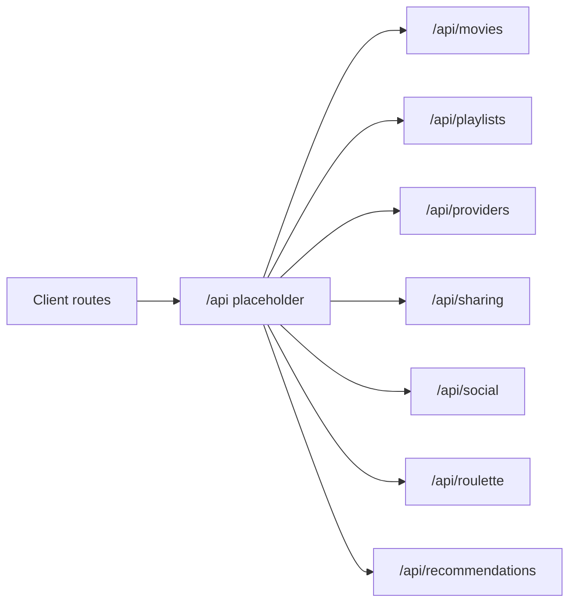

# API Design Placeholder

Flim should be API-first so the React web app and future native apps can share backend contracts.

Base path placeholder: `/api`.

No route handlers, external calls, persistence, auth, or business logic are implemented in Phase 1A.

## Route Planning Diagram

## Client Route Placeholders

- `/`
- `/discover`
- `/playlists`
- `/playlists/:id`
- `/public`
- `/roulette`
- `/profile`
- `/profile/playlists`
- `/profile/saved`
- `/profile/watched`
- `/providers`

## Movies

Namespace: `/api/movies`

Future route placeholders:

- `GET /api/movies`
- `GET /api/movies/:movieId`
- `POST /api/movies`

Notes: movie posters should be treated as first-class presentation fields. External movie database integration is explicitly out of scope.

## Playlists

Namespace: `/api/playlists`

Future route placeholders:

- `GET /api/playlists`
- `POST /api/playlists`
- `GET /api/playlists/:playlistId`
- `PATCH /api/playlists/:playlistId`
- `DELETE /api/playlists/:playlistId`
- `POST /api/playlists/:playlistId/movies`
- `PATCH /api/playlists/:playlistId/movies/:playlistItemId`
- `DELETE /api/playlists/:playlistId/movies/:playlistItemId`

Notes: support private, shared, and public visibility planning. Support save and clone flows through social/sharing contracts later.

## Providers

Namespace: `/api/providers`

Future route placeholders:

- `GET /api/providers`
- `GET /api/providers/:providerId`
- `GET /api/movies/:movieId/providers`
- `GET /api/movies/:movieId/links`

Notes: provider logos, deep links, platform URLs, and country-specific availability are planning-only. No streaming provider integration is implemented.

## Sharing

Namespace: `/api/sharing`

Future route placeholders:

- `POST /api/sharing/playlists/:playlistId/share-links`
- `GET /api/sharing/share-links/:shareId`
- `POST /api/sharing/playlists/:playlistId/collaborators`
- `DELETE /api/sharing/playlists/:playlistId/collaborators/:userId`

No email, notification, or real share-link behavior is included.

## Social

Namespace: `/api/social`

Future route placeholders:

- `POST /api/social/playlists/:playlistId/save`
- `POST /api/social/playlists/:playlistId/clone`
- `POST /api/social/playlists/:playlistId/follow`
- `DELETE /api/social/playlists/:playlistId/follow`
- `GET /api/social/playlists/:playlistId/stats`

No social feed, follower persistence, or popularity calculation is implemented.

## Roulette

Namespace: `/api/roulette`

Future route placeholders:

- `POST /api/roulette/spin`
- `POST /api/roulette/blind-spin`
- `GET /api/roulette/history`

Notes: Standard Roulette, Random Movie, Family Night, Date Night, and Blind Spin are planning concepts only. No randomization, filtering, provider opening, or secret selection exists in scaffold.

## Recommendations

Namespace: `/api/recommendations`

Future route placeholders:

- `GET /api/recommendations/movies`
- `GET /api/recommendations/playlists`
- `GET /api/recommendations/attribution`

Recommendation engines and AI features are explicitly out of scope for scaffold work.
