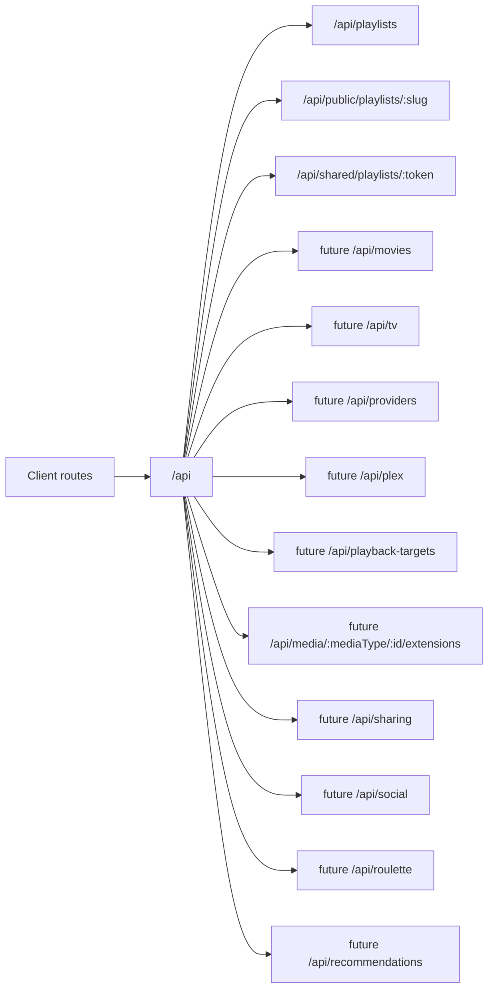

# API Design

Flim is API-first so the React web app and future native apps can share backend contracts.

Current app base path: `/api`.

Future public API base path: `/api/v1`.

The existing `/api` routes remain internal app routes. Future public resources should be introduced under `/api/v1` so versioning, rate limits, API keys, and public contracts can be added without breaking the web app.

Phase 2C uses Vercel serverless API routes backed by Neon PostgreSQL for playlists and playlist movies. `DATABASE_URL` remains server-side only.

## Route Diagram

## Client Routes

- `/`
- `/discover`
- `/playlists`
- `/playlists/:id`
- `/p/:slug`
- `/s/:token`
- `/movies/:tmdbId`
- `/public`
- `/roulette`
- `/profile`
- `/profile/playlists`
- `/profile/saved`
- `/profile/watched`
- `/providers`

## Playlists

Namespace: `/api/playlists`

Implemented route contracts:

- `GET /api/playlists`
- `POST /api/playlists`
- `GET /api/playlists/:playlistId`
- `DELETE /api/playlists/:playlistId`
- `POST /api/playlists/:playlistId/share`
- `GET /api/playlists/:playlistId/movies`
- `POST /api/playlists/:playlistId/movies`
- `DELETE /api/playlists/:playlistId/movies/:tmdbId`
- `PATCH /api/playlists/:playlistId/movies/:tmdbId/watched`

Notes: authenticated playlist routes enforce owner-only reads and mutations for private playlists. Public playlists are readable by everyone but owner-only for title mutations. Shared collaboration uses the separate shared-token routes below.

## Public Playlist Sharing

Namespace: `/api/public/playlists`

Implemented route contracts:

- `GET /api/public/playlists/:slug`
- `GET /api/public/playlists/:slug/movies`

Client route:

- `/p/:slug`

Notes: public share URLs use `playlists.public_slug` and require `visibility = 'public'`. QR codes for public playlists encode the same read-only public URL.

The `/p/:slug` page is served by a dynamic Vercel HTML wrapper so public links can include playlist-specific Open Graph metadata before the React app hydrates.

## Shared Playlist Links

Namespace: `/api/shared/playlists`

Implemented route contracts:

- `GET /api/shared/playlists/:token`
- `POST /api/shared/playlists/:token/movies`
- `DELETE /api/shared/playlists/:token/movies/:tmdbId`

Client route:

- `/s/:token`

Notes: shared playlist URLs use `playlists.shared_slug` and require `visibility = 'shared'`. Shared-link visitors can view, add, and remove titles, but cannot rename, delete, reorder, change visibility, or follow the playlist through public discovery.

## Movies

TMDb movie search remains client-side through the existing movie metadata service and environment variables. No movie data is stored outside playlist movie rows in this phase.

Future route contracts:

- `GET /api/movies/search`
- `GET /api/movies/:tmdbId`
- `GET /api/movies/:tmdbId/availability`

## TV Shows

Future namespace: `/api/tv`

Planned route contracts:

- `GET /api/tv/search`
- `GET /api/tv/:tmdbId`
- `GET /api/tv/:tmdbId/seasons`
- `GET /api/tv/:tmdbId/seasons/:seasonNumber/episodes`
- `PATCH /api/tv/:tmdbId/progress`
- `PATCH /api/tv/:tmdbId/seasons/:seasonNumber/episodes/:episodeNumber/watched`

## Watch Providers

Internal namespace: `/api/providers`

Implemented/internal route contracts:

- `GET /api/providers/availability`
- `GET /api/provider-link/:providerId/:tmdbId`

Provider links should not be hard-linked directly from the UI. The client links to `/api/provider-link/:providerId/:tmdbId`, and that route resolves the cached destination, records a provider click, and redirects to the provider. This keeps affiliate IDs, analytics, provider ranking tests, and partner rules server-side.

Future public route contracts:

- `GET /api/providers`
- `GET /api/providers/:providerId`
- `GET /api/providers/:providerId/search-fallback`
- `GET /api/media/:mediaType/:id/availability`

## Public ID Strategy

Internal database IDs should remain implementation details whenever possible. Future API resources should expose stable public IDs:

- Playlists: `playlist_<slug-or-token>`
- Users/curators: `user_<public-handle-or-token>`
- Titles: `title_<mediaType>_<tmdbId>`
- Release events: `release_event_<uuid>`
- Provider availability records: `provider_availability_<uuid>`

Do not expose private playlist IDs, raw user IDs, or auth/session identifiers in future public API payloads.

## Permission Model

Future API resources should reuse the app permission model instead of inventing per-route rules:

- `private`: owner-only read and write.
- `shared`: owner manages; link viewers may view and collaborate only where explicitly allowed.
- `public`: everyone may view; owner manages; signed-in users may follow/like where supported.
- `owner`: can edit/delete/change visibility.
- `viewer`: can read public/shared resources.
- `collaborator`: can mutate shared playlist titles only where the shared rules allow it.
- `follower`: can receive future updates for followed public resources.

These rules should be enforced server-side for every future public API endpoint.

## Future API Products

Potential API products remain documentation-only:

- Upcoming Releases API
- Playlist API
- Curator API
- Provider Availability API
- Release Intelligence API
- Trending Playlist API
- Followed Title API
- Notification API

Flim-owned data is the future API value: release intelligence, playlist activity, curator activity, followed titles, provider availability, public playlists, and curated collections. TMDb data should remain an import source, not the core product being resold.

## Plex

Future namespace: `/api/plex`

Planned route contracts:

- `GET /api/plex/status`
- `POST /api/plex/connect`
- `GET /api/plex/servers`
- `GET /api/plex/libraries`
- `POST /api/plex/libraries/import`
- `GET /api/plex/items`
- `POST /api/plex/items/match`
- `GET /api/plex/clients`
- `POST /api/plex/play`

Notes: Plex tokens and playback control must remain server-side unless a later security review approves otherwise.

## Playback Targets

Future namespace: `/api/playback-targets`

Planned route contracts:

- `GET /api/playback-targets`
- `GET /api/playback-targets/:targetId/capabilities`
- `POST /api/playback-targets/:targetId/play`

## Media Extensions

Future namespace: `/api/media/:mediaType/:id`

Planned route contracts:

- `GET /api/media/:mediaType/:id/extensions`
- `GET /api/media/:mediaType/:id/soundtrack`
- `GET /api/media/:mediaType/:id/trailers`
- `GET /api/media/:mediaType/:id/trivia`
- `GET /api/media/:mediaType/:id/awards`

## Future Namespaces

The following remain planned, not implemented:

- `/api/providers`
- `/api/tv`
- `/api/plex`
- `/api/playback-targets`
- `/api/media/:mediaType/:id/extensions`
- `/api/sharing`
- `/api/social`
- `/api/roulette`
- `/api/recommendations`

No auth, follower graph, comments, ratings, email, payments, scraping, or streaming-provider deep links are implemented in this phase.
