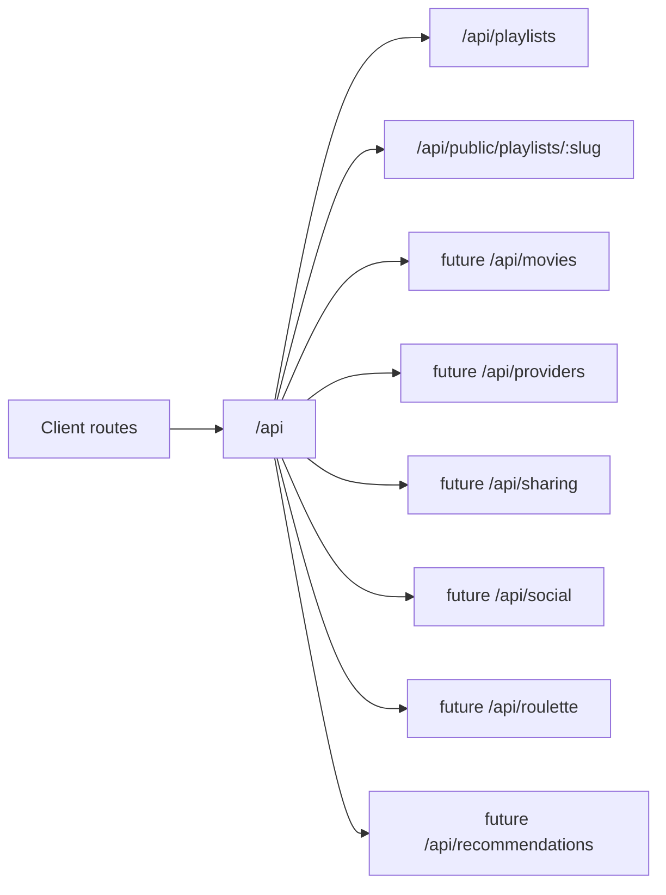

# API Design

Flim is API-first so the React web app and future native apps can share backend contracts.

Base path: `/api`.

Phase 2C uses Vercel serverless API routes backed by Neon PostgreSQL for playlists and playlist movies. `DATABASE_URL` remains server-side only.

## Route Diagram

## Client Routes

- `/`
- `/discover`
- `/playlists`
- `/playlists/:id`
- `/p/:slug`
- `/movies/:tmdbId`
- `/public`
- `/roulette`
- `/profile`
- `/profile/playlists`
- `/profile/saved`
- `/profile/watched`
- `/providers`

## Playlists

Namespace: `/api/playlists`

Implemented route contracts:

- `GET /api/playlists`
- `POST /api/playlists`
- `GET /api/playlists/:playlistId`
- `DELETE /api/playlists/:playlistId`
- `GET /api/playlists/:playlistId/movies`
- `POST /api/playlists/:playlistId/movies`
- `DELETE /api/playlists/:playlistId/movies/:tmdbId`
- `PATCH /api/playlists/:playlistId/movies/:tmdbId/watched`

Notes: `private`, `shared`, and `public` visibility values are stored now, but demo-stage access control is intentionally not enforced until auth/user ownership lands.

## Public Playlist Sharing

Namespace: `/api/public/playlists`

Implemented route contracts:

- `GET /api/public/playlists/:slug`
- `GET /api/public/playlists/:slug/movies`

Client route:

- `/p/:slug`

Notes: public share URLs use `playlists.public_slug`. QR codes encode the same public URL. Any playlist with a slug can be opened by direct link during the demo phase.

## Movies

TMDb movie search remains client-side through the existing movie metadata service and environment variables. No movie data is stored outside playlist movie rows in this phase.

## Future Namespaces

The following remain planned, not implemented:

- `/api/providers`
- `/api/sharing`
- `/api/social`
- `/api/roulette`
- `/api/recommendations`

No auth, follower graph, comments, ratings, email, payments, scraping, or streaming-provider deep links are implemented in this phase.
