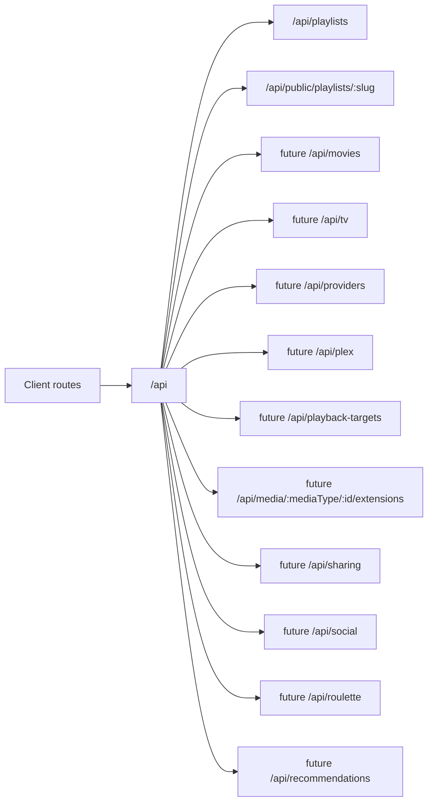

# API Design

Flim is API-first so the React web app and future native apps can share backend contracts.

Base path: `/api`.

Phase 2C uses Vercel serverless API routes backed by Neon PostgreSQL for playlists and playlist movies. `DATABASE_URL` remains server-side only.

## Route Diagram

## Client Routes

- `/`
- `/discover`
- `/playlists`
- `/playlists/:id`
- `/p/:slug`
- `/movies/:tmdbId`
- `/public`
- `/roulette`
- `/profile`
- `/profile/playlists`
- `/profile/saved`
- `/profile/watched`
- `/providers`

## Playlists

Namespace: `/api/playlists`

Implemented route contracts:

- `GET /api/playlists`
- `POST /api/playlists`
- `GET /api/playlists/:playlistId`
- `DELETE /api/playlists/:playlistId`
- `GET /api/playlists/:playlistId/movies`
- `POST /api/playlists/:playlistId/movies`
- `DELETE /api/playlists/:playlistId/movies/:tmdbId`
- `PATCH /api/playlists/:playlistId/movies/:tmdbId/watched`

Notes: `private`, `shared`, and `public` visibility values are stored now, but demo-stage access control is intentionally not enforced until auth/user ownership lands.

## Public Playlist Sharing

Namespace: `/api/public/playlists`

Implemented route contracts:

- `GET /api/public/playlists/:slug`
- `GET /api/public/playlists/:slug/movies`

Client route:

- `/p/:slug`

Notes: public share URLs use `playlists.public_slug`. QR codes encode the same public URL. Any playlist with a slug can be opened by direct link during the demo phase.

The `/p/:slug` page is served by a dynamic Vercel HTML wrapper so shared links can include playlist-specific Open Graph metadata before the React app hydrates.

## Movies

TMDb movie search remains client-side through the existing movie metadata service and environment variables. No movie data is stored outside playlist movie rows in this phase.

Future route contracts:

- `GET /api/movies/search`
- `GET /api/movies/:tmdbId`
- `GET /api/movies/:tmdbId/availability`

## TV Shows

Future namespace: `/api/tv`

Planned route contracts:

- `GET /api/tv/search`
- `GET /api/tv/:tmdbId`
- `GET /api/tv/:tmdbId/seasons`
- `GET /api/tv/:tmdbId/seasons/:seasonNumber/episodes`
- `PATCH /api/tv/:tmdbId/progress`
- `PATCH /api/tv/:tmdbId/seasons/:seasonNumber/episodes/:episodeNumber/watched`

## Watch Providers

Future namespace: `/api/providers`

Planned route contracts:

- `GET /api/providers`
- `GET /api/providers/:providerId`
- `GET /api/providers/:providerId/search-fallback`
- `GET /api/media/:mediaType/:id/availability`

## Plex

Future namespace: `/api/plex`

Planned route contracts:

- `GET /api/plex/status`
- `POST /api/plex/connect`
- `GET /api/plex/servers`
- `GET /api/plex/libraries`
- `POST /api/plex/libraries/import`
- `GET /api/plex/items`
- `POST /api/plex/items/match`
- `GET /api/plex/clients`
- `POST /api/plex/play`

Notes: Plex tokens and playback control must remain server-side unless a later security review approves otherwise.

## Playback Targets

Future namespace: `/api/playback-targets`

Planned route contracts:

- `GET /api/playback-targets`
- `GET /api/playback-targets/:targetId/capabilities`
- `POST /api/playback-targets/:targetId/play`

## Media Extensions

Future namespace: `/api/media/:mediaType/:id`

Planned route contracts:

- `GET /api/media/:mediaType/:id/extensions`
- `GET /api/media/:mediaType/:id/soundtrack`
- `GET /api/media/:mediaType/:id/trailers`
- `GET /api/media/:mediaType/:id/trivia`
- `GET /api/media/:mediaType/:id/awards`

## Future Namespaces

The following remain planned, not implemented:

- `/api/providers`
- `/api/tv`
- `/api/plex`
- `/api/playback-targets`
- `/api/media/:mediaType/:id/extensions`
- `/api/sharing`
- `/api/social`
- `/api/roulette`
- `/api/recommendations`

No auth, follower graph, comments, ratings, email, payments, scraping, or streaming-provider deep links are implemented in this phase.
