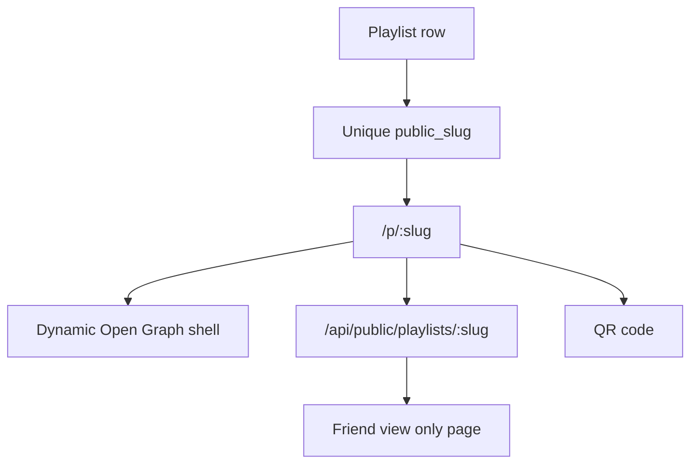

# Playlist Sharing System

Playlist sharing makes public playlists easy to send, scan, and revisit.

## Current Behavior

- Every playlist receives a unique `public_slug`.
- New slugs try the clean playlist name first, such as `movies-dad-wants-anthony-to-watch`.
- If the clean slug already exists, Flim appends a short suffix.
- Share URLs use `/p/:slug`.
- Public playlists expose the public URL.
- Private playlists prompt the owner to make the playlist public before showing a URL or QR code.
- Users can copy the link.
- Browsers with `navigator.share` can open the native share sheet.
- A QR code is generated for the same public URL.
- The QR code can be downloaded as a PNG.
- Friends can open public links or QR codes without logging in.
- Public playlist pages are view-only.
- Public playlist URLs receive playlist-specific Open Graph metadata.
- Signed-in users can follow public playlists.

Example public URL format:

```text
https://www.flim.ca/p/movies-dad-wants-anthony-to-watch
```

## Current API

- `GET /api/public/playlists/:slug`
- `GET /api/public/playlists/:slug/movies`

## Public Page Metadata

The `/p/:slug` route is served through a Vercel function that injects playlist-specific metadata into the app shell:

- Playlist title.
- Description or movie count.
- `Shared via Flim`.
- Poster artwork when available.
- Canonical public playlist URL.

This improves previews in Messages, Discord, Messenger, email, and other social surfaces.

## Access Model

The canonical rules live in `playlist-visibility-rules.md`.

- Private playlists are owner-only and do not expose public URLs.
- Public playlists can be viewed, followed, and shared by everyone.
- Public playlist mutation remains owner-only.
- Shared collaboration is planned and documented, but it is not exposed as a working visitor-edit flow yet.

## Future Sharing Capabilities

- Authenticated playlist ownership.
- Playlist collaborators.
- Share analytics.
- Expiring or revocable share links.

## Architecture Diagram


