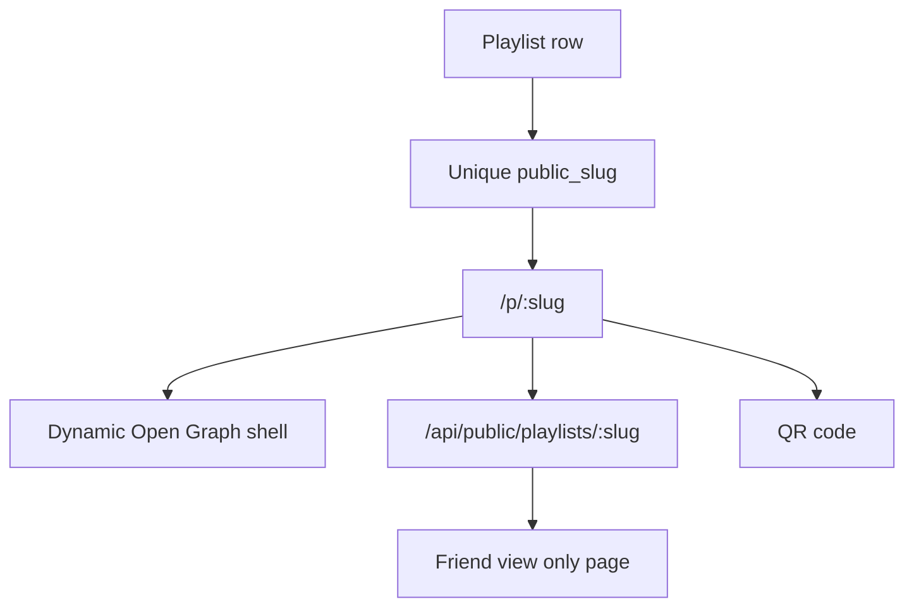

# Playlist Sharing System

Phase 3A makes public playlist sharing the first Flim wow moment.

## Current Behavior

- Every playlist receives a unique `public_slug`.
- New slugs try the clean playlist name first, such as `movies-dad-wants-anthony-to-watch`.
- If the clean slug already exists, Flim appends a short suffix.
- Share URLs use `/p/:slug`.
- The share panel displays the public URL.
- Users can copy the link.
- Browsers with `navigator.share` can open the native share sheet.
- A QR code is generated for the same public URL.
- The QR code can be downloaded as a PNG.
- Friends can open the link or QR code without logging in.
- Public playlist pages are view-only.
- Public playlist URLs receive playlist-specific Open Graph metadata.

Example public URL format:

```text
https://www.flim.ca/p/movies-dad-wants-anthony-to-watch
```

## Current API

- `GET /api/public/playlists/:slug`
- `GET /api/public/playlists/:slug/movies`

## Public Page Metadata

The `/p/:slug` route is served through a Vercel function that injects playlist-specific metadata into the app shell:

- Playlist title.
- Description or movie count.
- `Shared via Flim`.
- Poster artwork when available.
- Canonical public playlist URL.

This improves previews in Messages, Discord, Messenger, email, and other social surfaces.

## Demo-Stage Access Model

For this phase, any playlist with a `public_slug` can be opened by direct link.

`private`, `shared`, and `public` visibility values are stored for future behavior, but auth and access control are not enforced yet.

## Future Sharing Capabilities

- Real private/shared/public permissions.
- Authenticated playlist ownership.
- Playlist collaborators.
- Saved playlists.
- Follower counts.
- Share analytics.
- Expiring or revocable share links.

## Architecture Diagram


