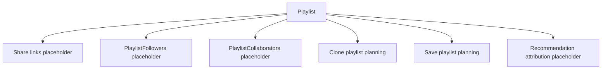

# Playlist Sharing System

Phase 1A only updates planning for playlist sharing, saving, cloning, and collaboration.

No auth, email, notifications, share-link creation, permission enforcement, or persistence is implemented.

## Future Sharing Capabilities

- Share playlists.
- Make playlists private, shared, or public.
- Save another user's playlist.
- Clone another user's playlist.
- Collaborate on playlists.
- Follow public playlists.
- See follower counts and popularity signals.
- See who recommended movies.

## Placeholder Entities

- Playlists.
- PlaylistMovies.
- PlaylistFollowers.
- PlaylistCollaborators.
- Shares.
- Recommendations.

## Client Planning Surfaces

- `SharePlaylistModal`.
- `SavePlaylistButton`.
- `ClonePlaylistButton`.
- `PublicPlaylistCard`.
- `PlaylistFollowers`.
- `PlaylistStats`.
- `RecommendationBadge`.

## API Planning Surfaces

- `/api/sharing` for share links and collaborators.
- `/api/social` for save, clone, follow, and stats planning.

## Architecture Diagram

