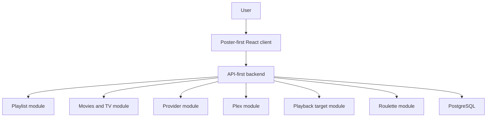

# Product Bible

## Product Vision

Flim is a movie and TV playlist platform.

Think: Spotify playlists for movies and TV shows.

Flim helps people create playlists of movies and TV shows, browse them visually through posters, and share those playlists with friends, family, and the public.

Long-term, Flim becomes the decision layer above entertainment services: it helps users decide what to watch, then opens the best available place to watch it.

## What Flim Is Not

- Not a movie review platform.
- Not a streaming platform.
- Not a replacement for Netflix, Disney+, Prime Video, Plex, Jellyfin, Emby, or Apple TV.
- Not an IMDb clone.
- Not a Letterboxd clone.
- Not a social feed-first entertainment network.
- Not a universal smart TV remote.

## Core Product Promise

When someone says, "You have to watch this," Flim gives users a fast, visual place to save it before they forget, organize it into playlists, return to it later, and open the best available watch destination.

## Example Playlists

- Movies Anthony Wants Dad To Watch.
- Movies Dad Wants Anthony To Watch.
- Best Sci-Fi Ever Made.
- Family Movie Night.
- Date Night Movies.
- Movies To Watch This Summer.
- Shows To Watch.
- Anime List.
- Shows We Finished.

## Core User Experience

Future users should be able to:

- Search movies.
- Search TV shows.
- Add movies and TV shows to playlists.
- Create unlimited playlists.
- Name playlists.
- Add descriptions to playlists.
- Share playlists.
- Make playlists private, shared, or public.
- Save another user's playlist.
- Clone another user's playlist.
- Track watched status.
- Track TV seasons and episodes.
- See where a title can be watched.
- See whether a title exists in a connected Plex library.
- Open streaming provider fallbacks or exact links when known.
- Use Movie Night Roulette.

## Poster-First Presentation

Posters are the primary UI element.

Flim should feel closer to Netflix, Prime Video, Disney+, Plex, Letterboxd lists, and movie theatre websites than spreadsheets, admin tables, or text lists.

Each future media card should support poster, title, year, runtime, genres, media type, streaming providers, Plex availability, and watch status.

## Product Architecture Diagram

## Architecture Principles

- API-first so future native clients can share backend contracts.
- Poster-first so movies and TV shows feel visual and browsable.
- Playlists-first so the primary user object stays simple.
- Honest provider behavior: search fallback unless availability is confirmed.
- Plex-first for realistic personal library and remote playback planning.
- Modular boundaries for media, providers, Plex, playback targets, playlists, sharing, and Roulette.
- Mobile-friendly from every implemented UI pass.
