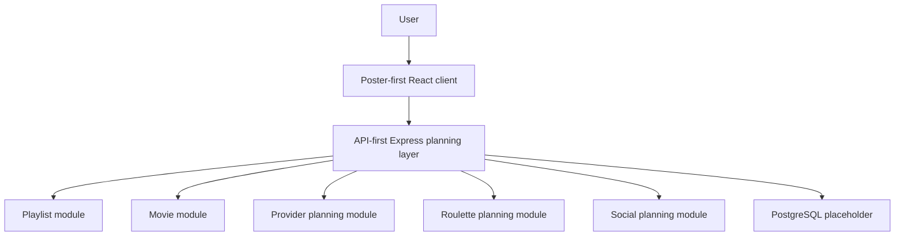

# Product Bible

## Product Vision

Flim is a movie playlist platform.

Think: Spotify playlists for movies.

Flim helps people create collections of movies, browse them visually through posters, and share those collections with friends, family, and the public.

## What Flim Is Not

- Not a movie review platform.
- Not a streaming platform.
- Not an IMDb clone.
- Not a Letterboxd clone.
- Not a social feed-first entertainment network.

## Core Product Promise

When someone says, "You have to watch this movie," Flim gives users a fast, visual place to save it before they forget, organize it into playlists, and return to it later with provider-link support.

## Example Playlists

- Movies Anthony Wants Dad To Watch
- Movies Dad Wants Anthony To Watch
- Best Sci-Fi Ever Made
- Family Movie Night
- Date Night Movies
- Movies To Watch This Summer
- 80s Action Classics
- Movies Everyone Should See Once

## Core User Experience

Future users should be able to:

- Search movies.
- Add movies to playlists.
- Create unlimited playlists.
- Name playlists.
- Add descriptions to playlists.
- Share playlists.
- Make playlists private, shared, or public.
- Save another user's playlist.
- Clone another user's playlist.
- Track watched status.
- Open streaming providers directly.
- Use Movie Roulette.

## Poster-First Presentation

Movie posters are the primary UI element.

Flim should feel closer to Netflix, Prime Video, Disney+, and movie theatre websites than spreadsheets, admin tables, or text lists.

Each future movie card should support poster, title, year, runtime, genres, streaming providers, and watch status.

## Product Architecture Diagram

## Phase 1A Constraints

- No authentication.
- No payments.
- No notifications.
- No streaming integrations.
- No movie database integrations.
- No recommendation engines.
- No AI features.
- No social feeds.
- No real business logic.
- No backend services.
- No database implementation.
- No external APIs.
- No email systems.
- No mock data.

## Architecture Principles

- API-first so future native clients can share backend contracts.
- Poster-first so movies feel visual and browsable.
- Modular so movies, providers, playlists, sharing, social planning, and roulette can evolve independently.
- Mobile-friendly from the first implemented UI pass.
- Clear separation between presentation, application services, repositories, schemas, and shared contracts.
