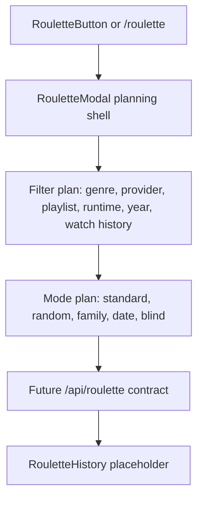

# Movie Roulette System

Movie Roulette is a core Flim feature, but Phase 1A only defines architecture and placeholders.

No randomization, filtering, movie selection, provider redirect, history persistence, or premium gating is implemented.

## Purpose

Help users decide what to watch from playlists, providers, genres, or personal watch history when choice fatigue gets in the way.

## Possible Filters

- Genre.
- Streaming service.
- Playlist.
- Runtime.
- Release year.
- User watch history.

## Possible Modes

- Standard Roulette.
- Random Movie.
- Family Night.
- Date Night.
- Blind Spin.

## Blind Spin

Blind Spin is a premium Flim feature concept.

Planned flow:

1. User selects genres, providers, playlists, and filters.
2. Flim secretly chooses a movie.
3. Flim opens the provider destination instead of revealing the title in-app.
4. The user discovers the selected movie on the provider page.

Phase 1A scope: document this only.

## Architecture Diagram

## Future Contracts

Shared placeholders:

- `RouletteMode`.
- `RouletteFilterPlan`.
- `RouletteHistory`.

Client placeholders:

- `RouletteButton`.
- `RouletteModal`.
- `BlindSpinModal`.
- `/roulette` route.

Server placeholders:

- `server/src/modules/roulette`.
- `server/src/schemas/roulette.schema.ts`.
