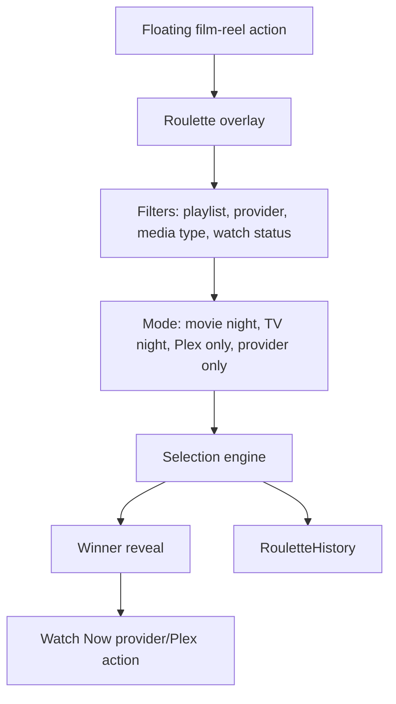

# Movie Night Roulette System

Movie Night Roulette is a signature Flim feature. It should answer "What should we watch tonight?" with anticipation and a rewarding reveal.

## Purpose

Help users decide what to watch from playlists, providers, Plex libraries, genres, media types, or watch history when choice fatigue gets in the way.

## Current Product Shape

Roulette is a tool layered over playlists, not a primary navigation destination. The floating film-reel button opens the full-screen Roulette overlay.

## Future Filters

- Playlist.
- Provider.
- Plex availability.
- Movie.
- TV.
- Watched.
- Unwatched.
- Runtime.
- Genre.
- Decade.
- Release year.
- User watch history.

## Future Modes

- Movie Night.
- TV Night.
- Family Night.
- Date Night.
- Kids Night.
- Plex Only.
- Netflix Only.
- Disney Only.
- Unwatched Only.
- Blind Spin.

## Winner Reveal

The reveal should dominate the screen and support:

- Large poster.
- Title.
- Year.
- Media type.
- Provider options.
- `Watch Now`.
- `Watch On Plex`.
- `View Details`.
- `Share Movie Night`.

## Blind Spin

Blind Spin is a future premium feature concept.

Planned flow:

1. User selects genres, providers, playlists, media type, and filters.
2. Flim secretly chooses a title.
3. Flim opens the provider destination instead of revealing the title in-app.
4. The user discovers the selected title on the provider page.

## Architecture Diagram

## Future Contracts

- `RouletteMode`.
- `RouletteFilterPlan`.
- `RouletteHistory`.
- `MediaType`.
- `PlaybackTarget`.
- `ProviderCapabilities`.
