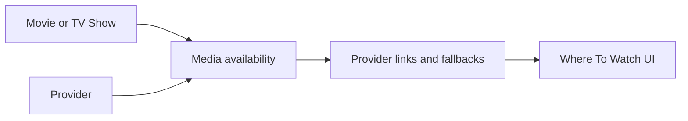

# Streaming Provider Strategy

Flim helps users decide what to watch, then opens the best available place to watch it.

This strategy does not claim universal provider availability or smart TV launching. Availability must be verified by an approved data source or a connected personal library before it is displayed as fact.

## V1 Provider Source Recommendation

Use Watchmode first for V1.

Reasoning:

- It supports movie and TV availability lookups by TMDb-style title IDs.
- It supports region filtering, including Canada.
- It returns provider source names, access type, and web URLs that can be normalized into Flim's cache.
- It is practical for an early product integration because the API contract is straightforward and can be gated behind `WATCHMODE_API_KEY`.

JustWatch Partner API remains a strong long-term option because JustWatch has broad catalog coverage, but access is partner-oriented and may require commercial approval before it can be used in production.

Streaming Availability API can also be evaluated later if pricing, coverage, and terms fit better, but Flim should keep the same normalized cache contract either way.

## Provider Source Comparison

| Source | Strengths | Tradeoffs | Fit |
| --- | --- | --- | --- |
| Watchmode | Movies and TV, region filtering, provider source names, access type, links/deep links, logos, straightforward API-key integration. Public docs describe more than 200 services worldwide and region-filtered source lookups. | Requires `WATCHMODE_API_KEY`; coverage and limits depend on plan. | Recommended V1 source because it is practical to wire behind Flim's existing cache endpoint. |
| JustWatch Partner API | Broad provider coverage, strong consumer brand recognition, widgets/API/data export. JustWatch partner docs describe VOD availability for large movie/TV catalogs, more than 500 providers, and more than 100 countries. | Partner/commercial access path; branded-link requirements; may need approval before production use. | Best long-term data partner if Flim needs deep commercial-quality coverage and partnership support. |
| Streaming Availability API | Movies and series, country/service coverage, current public positioning describes hundreds of platforms across 60+ countries with deep links. | Separate provider taxonomy and pricing/limits need review; would require a mapper into Flim's normalized provider tables. | Good fallback candidate if Watchmode pricing, quota, or coverage becomes limiting. |

Decision: keep Watchmode as the V1 integration target, but keep the normalized cache schema provider-agnostic so Flim can swap to JustWatch or Streaming Availability API without rewriting the UI.

## Provider Support

Planned examples:

- Plex.
- Netflix.
- Amazon Prime / Prime Video.
- Disney+.
- Apple TV.
- Crave.
- Paramount+.
- Hulu.
- Peacock.
- Tubi.
- YouTube Movies.
- Other regional providers.

## Current V1 Behavior

Where To Watch now uses a cache-first Flim API endpoint:

```text
GET /api/providers/availability?mediaType=movie|tv&tmdbId=123&title=Title&region=CA
```

Flow:

1. Resolve the title from `media_items` by media type and TMDb ID.
2. Check `title_availability` for unexpired region-specific data.
3. Return cached links if available.
4. Check `provider_availability_cache` so empty confirmed checks are not repeated.
5. If no cache exists and `WATCHMODE_API_KEY` is configured, call Watchmode.
6. Normalize provider names, access type, deep link, search fallback URL, and region.
7. Store results in Neon and update `media_items.provider_last_checked`.
8. Future requests use the Neon cache first.

If no provider source is configured, or no provider availability is known, the app shows exactly:

```text
Streaming availability coming soon.
```

It does not show fake provider logos or claim availability without confirmed data.

Current implementation status:

- Movie and TV detail pages call the Flim provider endpoint.
- The endpoint checks Neon before any external call.
- Confirmed provider rows display as tappable logo buttons.
- If Watchmode returns an exact link, Flim opens it.
- If confirmed availability exists but no exact link exists, Flim uses the stored provider search fallback.
- Plex remains a future provider and is not shown as available unless a real `library` availability row exists.

## Provider Fields

Movies and TV shows should eventually be able to reference:

- Provider information.
- Provider logos.
- Deep links.
- Platform URLs.
- Country-specific availability.
- Access type: subscription, rent, buy, free, library, or unknown.
- Link type: exact URL, deep link, search fallback, or connect placeholder.
- Provider capability notes for web, mobile, app, cast, and remote playback behavior.

## Provider Search And Filtering

Future filters should support:

- Single provider selection, such as Netflix.
- Multiple provider selection, such as Netflix + Disney+ + Plex.
- Plex-only media from a connected library.
- Region-aware availability.
- Unknown availability with honest fallback links.

Provider search behavior:

- Prefer exact movie or show links when confirmed.
- Fall back to provider search pages.
- Never show "available on" language unless availability is known.
- Never scrape provider pages.
- Never claim universal smart TV launch behavior.

## V1 Cache Tables

- `watch_providers`
- `title_availability`
- `provider_links`
- `provider_region`
- `provider_availability_cache`

Availability rows are keyed by media type, TMDb ID, region, provider, and access type. Canada (`CA`) is the default region for V1.

`provider_availability_cache` records that Flim checked a title and region even when no provider links were returned, so empty results do not repeatedly call the provider source.

## Contract Placeholders

- `MovieAvailability`.
- `WatchProvider`.
- `WatchProviderLink`.
- `ProviderRegion`.
- `ProviderDeepLink`.
- `ProviderSearchFallback`.
- `ProviderCapabilities`.

## Architecture Boundaries

- Client components display provider information only after API contracts provide display-ready fields.
- Server provider modules coordinate provider data only after integration scope is opened.
- Repositories isolate future PostgreSQL persistence for providers, media-provider availability, and provider links.
- Shared types define provider contracts without implementation.

## Architecture Diagram


