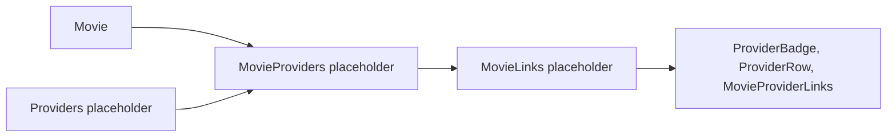

# Streaming Provider Strategy

Phase 1A creates architecture only. It does not connect to streaming providers, movie databases, availability APIs, or external links.

## Future Provider Support

Planned examples:

- Netflix.
- Amazon Prime.
- Disney+.
- Apple TV.
- Crave.
- Paramount+.
- Hulu.
- Peacock.
- Tubi.
- YouTube Movies.
- Other regional providers.

## Future Movie Provider Fields

Movies should eventually be able to reference:

- Provider information.
- Provider logos.
- Deep links.
- Platform URLs.
- Country-specific availability.
- Access type: subscription, rent, buy, free, library, or unknown.

## Architecture Boundaries

- Client components display provider information only after API contracts provide display-ready fields.
- Server provider modules coordinate provider data only after integration scope is opened.
- Repositories isolate future PostgreSQL persistence for Providers, MovieProviders, and MovieLinks.
- Shared types define provider contracts without implementation.

## Architecture Diagram

