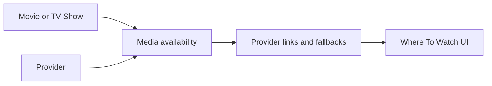

# Streaming Provider Strategy

Flim helps users decide what to watch, then opens the best available place to watch it.

This strategy does not claim universal provider availability or smart TV launching. Availability must be verified by an approved data source or a connected personal library before it is displayed as fact.

## Provider Support

Planned examples:

- Plex.
- Netflix.
- Amazon Prime / Prime Video.
- Disney+.
- Apple TV.
- Crave.
- Paramount+.
- Hulu.
- Peacock.
- Tubi.
- YouTube Movies.
- Other regional providers.

## Provider Fields

Movies and TV shows should eventually be able to reference:

- Provider information.
- Provider logos.
- Deep links.
- Platform URLs.
- Country-specific availability.
- Access type: subscription, rent, buy, free, library, or unknown.
- Link type: exact URL, deep link, search fallback, or connect placeholder.
- Provider capability notes for web, mobile, app, cast, and remote playback behavior.

## Provider Search And Filtering

Future filters should support:

- Single provider selection, such as Netflix.
- Multiple provider selection, such as Netflix + Disney+ + Plex.
- Plex-only media from a connected library.
- Region-aware availability.
- Unknown availability with honest fallback links.

Provider search behavior:

- Prefer exact movie or show links when confirmed.
- Fall back to provider search pages.
- Never show "available on" language unless availability is known.
- Never scrape provider pages.
- Never claim universal smart TV launch behavior.

## Contract Placeholders

- `MovieAvailability`.
- `WatchProvider`.
- `WatchProviderLink`.
- `ProviderRegion`.
- `ProviderDeepLink`.
- `ProviderSearchFallback`.
- `ProviderCapabilities`.

## Architecture Boundaries

- Client components display provider information only after API contracts provide display-ready fields.
- Server provider modules coordinate provider data only after integration scope is opened.
- Repositories isolate future PostgreSQL persistence for providers, media-provider availability, and provider links.
- Shared types define provider contracts without implementation.

## Architecture Diagram

